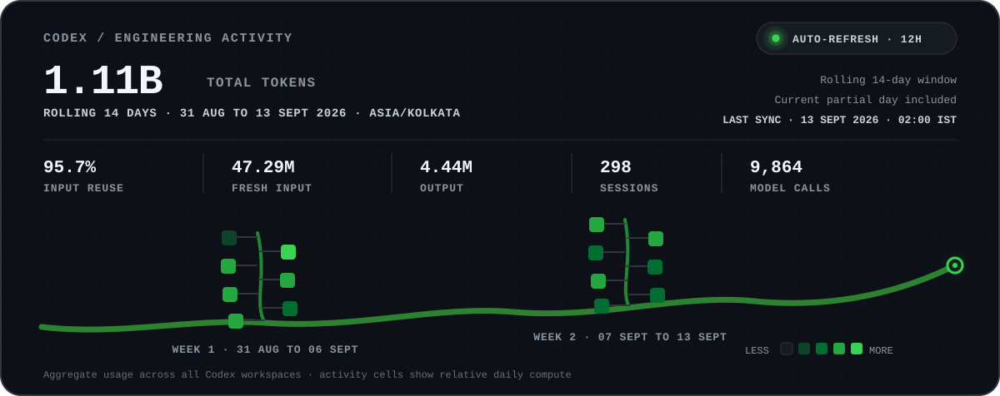

<h1 align="center">Hi, I'm Rahul 👋</h1>

  <strong>AI Agent Engineer · Backend Architect</strong> 
  📍 India

  I design and ship production AI systems—autonomous agents, grounded retrieval, and backend infrastructure that stays reliable beyond the demo.

  
  

---

## The systems behind production AI

After **5 years in backend-heavy product teams** and **1.5+ years working independently**, I focus on the engineering layer that makes AI useful in production: state, orchestration, tool execution, asynchronous workflows, observability, and guardrails.

My work sits at the intersection of **agent architecture**, **backend systems**, and **AI-native product engineering**.

## Products I'm building

- **[Cernora](https://cernora.xyz)** — An AI brand strategist in Slack that maintains a living memory of a company's brand, customers, market, and prior work—then turns that context into grounded recommendations, briefs, plans, and drafts.

- **[Crewline](https://crewline.in)** — A ticket-to-PR platform for autonomous coding agents. Agents work in isolated repository sandboxes, implement and test changes, pass through dedicated QA, and return reviewable GitHub pull requests—while the human controls scope and decisions.

- **[Capila](https://capilahealth.com)** — A clinic-configured hair-transplant recovery platform that turns post-op protocols into personalized timelines, reminders, and always-available AI support for patients.

- **[Knowledge Assistant](https://knowledge-assistant.lovable.app)** — A RAG assistant for long-form documents that retrieves relevant passages and returns source-grounded answers with citations.

## Recent engineering activity

  Rolling 14-day aggregate across all Codex workspaces · refreshed regularly · current partial day included. Cached input represents reused model context; token volume is not a productivity score.

## What I build

- Multi-agent runtimes, orchestration, and reliable tool execution
- Retrieval, memory, and knowledge systems
- Event-driven backends, asynchronous workflows, and clean data models
- Evaluation, observability, guardrails, and human-in-the-loop controls
- AI-native SaaS designed to move beyond prototype scale

## How I think about agents

> The model is one component. Production agents need deterministic workflows, durable state, observable execution, scoped tools, and explicit human control.

## Core stack

## Work with me

I help teams turn AI prototypes into dependable products—especially agent platforms, retrieval systems, workflow automation, and backend-heavy AI SaaS.

**[View my work](https://rahul-gusai.vercel.app/)** · **[Connect on LinkedIn](https://www.linkedin.com/in/rahulgusai/)**
